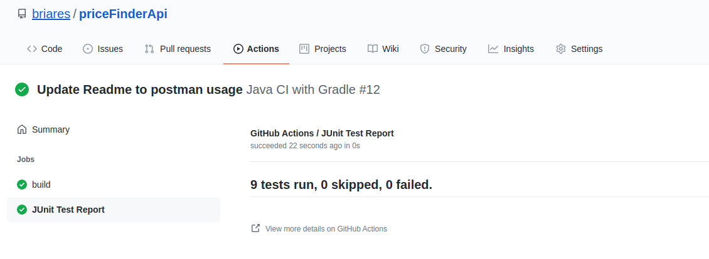

## Price Api

Project example that uses spring Rest & spring repository

## How to build with Gradle

This project is a gradle project (gradle wrapper version 7 included)

> ./gradlew clean build

To run the project as Spring boot application, you can use:

> ./gradlew bootrun

## How to build with Docker

The application includes a docker file and you can use gradle to build the image.

> ./gradlew bootBuildImage --imageName=briares/priceapi

Then you can run the container:

> docker run -p 8080:8080 -t briares/priceapi
  
---
**NOTE**

This app use port 8080, so be sure that any other application is using that port

---

## Swagger

I've included Open Api documentation in this app. Once the application is running you can use swagger-ui using your browser: 

http://localhost:8080/priceApi/swagger-ui/index.html?configUrl=/priceApi/api-docs/swagger-config#/

## Curl is another client Api you can use. Here is an example: 
```
curl -X 'GET' \
'http://localhost:8080/priceApi/prices?brandId=1&productId=35455&dateOfApplication=2020-06-14T10%3A37%3A50.483Z' \
-H 'accept: application/json'
```

## Postman

A postman collection with the 5 test is provided under the postman folder in the repository. To use this collection
you need to import in postman IDE.

Alternatively you can use this link (if you have a postman account) to import the collection:
https://www.getpostman.com/collections/3a22c95f48d09fc7ea14

## Pipeline

There is one github action configured. On every push to the repository, the github action is executed and one will be able 
to see the build and test results. All you need to do is to click Actions button in Github and the job:



## Database

The app uses an in-memory h2 database. That means that every time the application is restarted, the database is dropped and created once again.

There are two files in the classpath under the resource directory (data.sql & schema.sql), that creates the schema
database and populates the database with data.

If you want to access the database console you can do it using your browser with this URL: http://localhost:8080/priceApi/h2-console,
and then you have to specify this parameters:

```
JDBC URL: jdbc:h2:mem:priceReporting
User: sa
Password: testdb
```

## Technical considerations
* The application uses Lombok because simplifies development
* The application uses mapstruts to map from Dto to Models and viceversa
* I don't use a logback file, it is configured in application.yml, but for 
  production, should be a best practice to use logback file.
* There's only one profile present (default profile). In PROD, is a good practice to create
  several for every stage.

## Application considerations
* I use dto's to transport data between layers. I know, that are some detractors 
  that tell that is better not to use dto's, but I think that in general is not
  a bad practice. Another approach could be to use hexagonal architectures with ports and
  adapters (that I'm using in some of my current projects), but this is a simple
  project and I considered that adding this extra layer is over engineering.
* For the data access layer, I use Spring Data with a custom jpql query to solve the problem 
  of search the price of the product.
* Request validations error (for example null values or invalid date) are handle by spring. Result will be
  standard http 400 error, but without pretty messages. Client will receive the full stack trace of error. 
  I know that it is a bad practice, event could be a security concern, but implementing a custom error handler
  is out of the scope for now.
* I didn't use any extra tables. For example. In a real scenario we would have to use a currency table to store
  the currency descriptions, store table to save the stores and so on.
* I've decided to use ISO-8601 for the request parameter for the date. Another option could have been to 
  use epoch time: https://www.epochconverter.com/
* Regarding the integration test, I would prefer to test the query in the service and data layer instead
  of testing the rest controller.  I tend to follow the test pyramid (https://martinfowler.com/articles/practical-test-pyramid.html) 
  practice because testing the web layer is very slow both for development and execution. In fact, lately I 
  prefer contract testing.
  

